# AdvanceProg-Part4
## What the project is about?
This is the **fourth** stage of a building a working drive for the course "Advanced Programming". In this part of the project we have implement the GUI part. We used *React* to connect with our previous servers, and make it accessable for the user.

## UML
### $\color{pink}{\text{File Server UML}}$
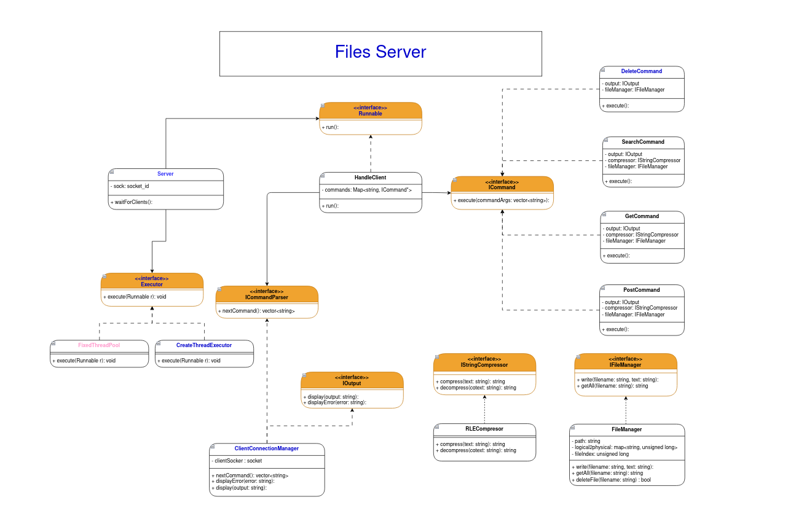

### $\color{pink}{\text{Web Server UML}}$
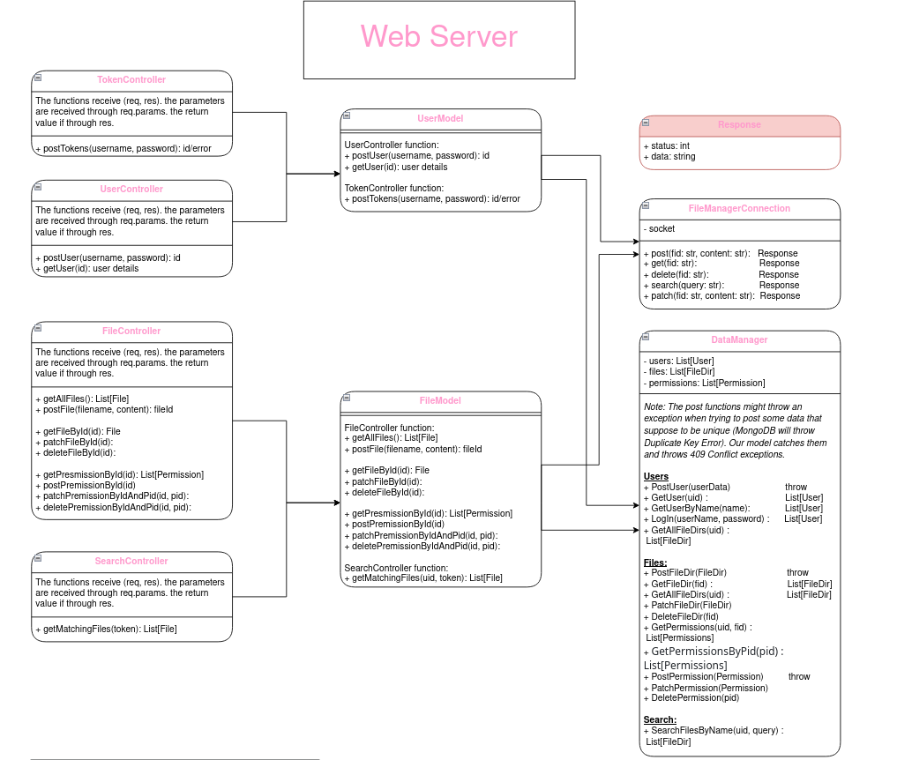

### $\color{pink}{\text{Web App UML}}$
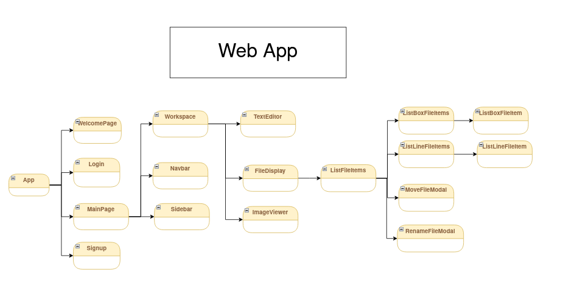

## Running the Project
### Building all images
To run the project, type
```bash
docker compose up --build file_server web_server web app
```
* The `file server` is the server in charge of saving the files.
* The `web server` is the server in charge of the metadata, users and permissions management.
* The `web app` is the view tier. It's incharge of presenting the project in a comftable way to the user.

When running the command above, all of our code will compile and run. Then, to use the app, simply go to your favourite web browser and browse for `localhost:3000`.
## The different pages
### Welcome page
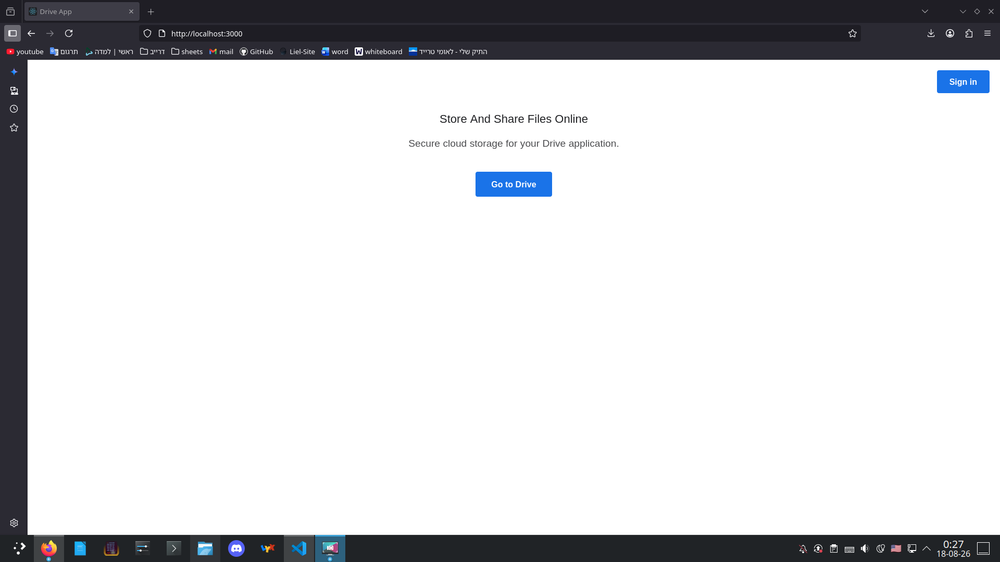
### Log-in page
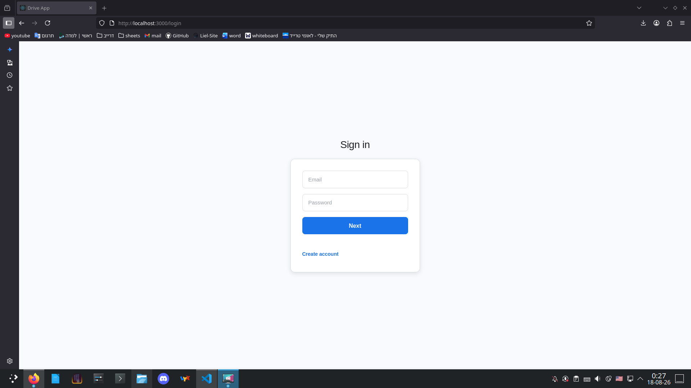
### Sign-up page
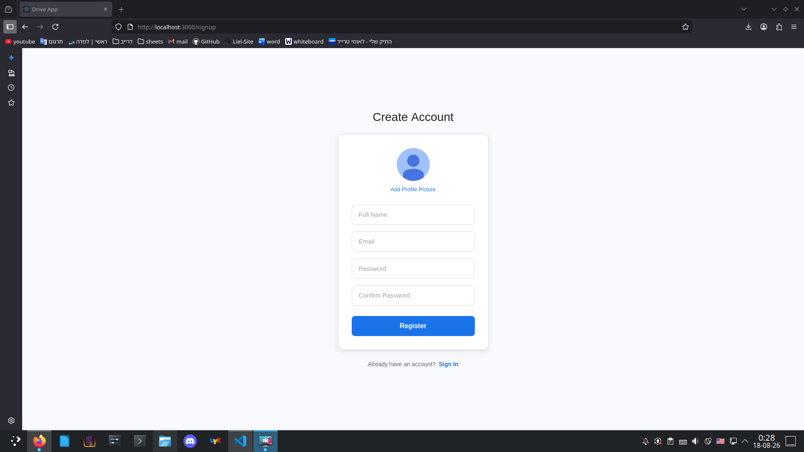
### Sign-up page

### Main page
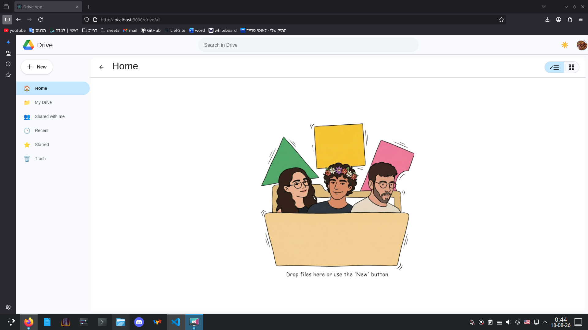
### Text editor
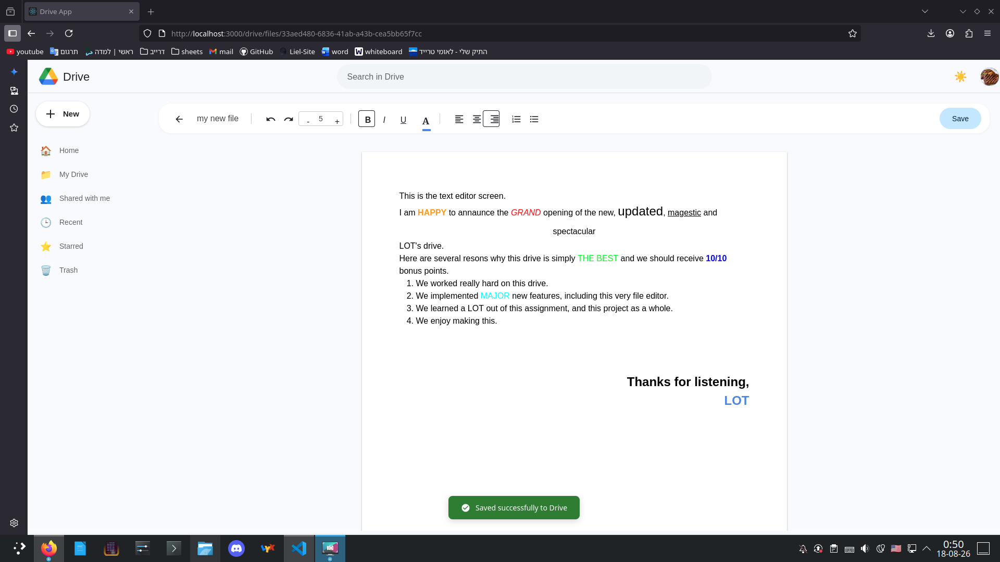
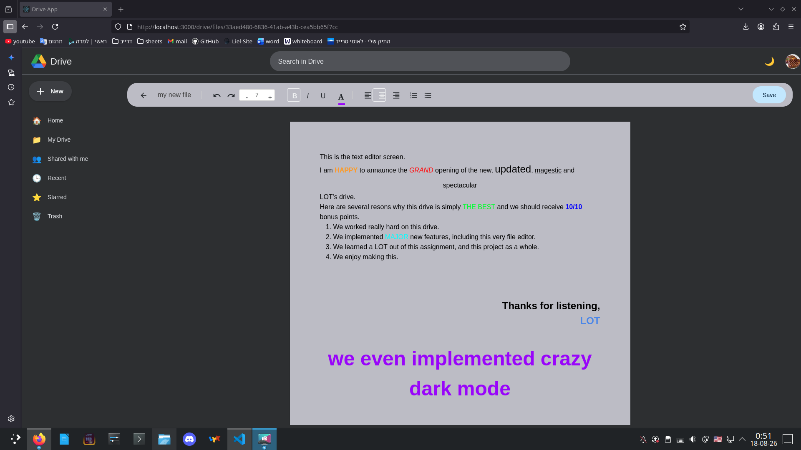
### Image viewer
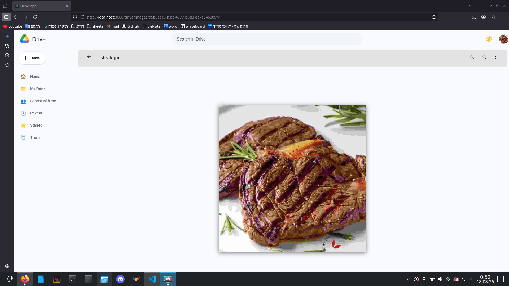
### File menu
You can reach the file menu by clicking on the three dots to the side or by right clicking the file/directory.
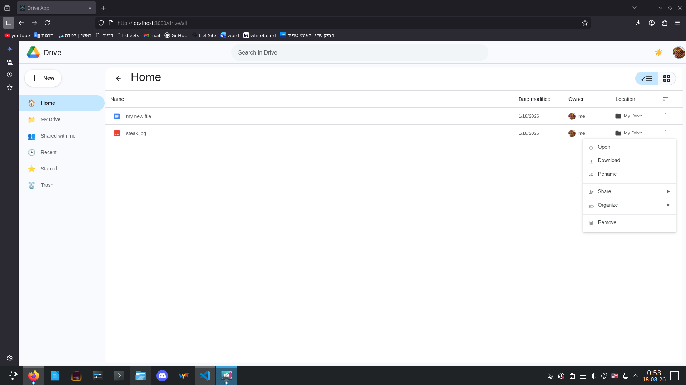
### Move screen
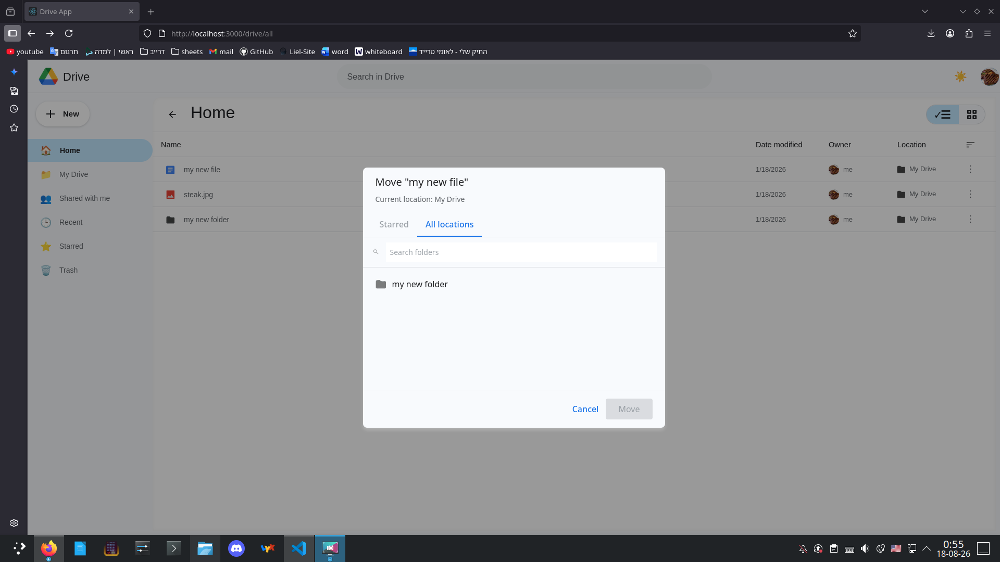
### Rename screen
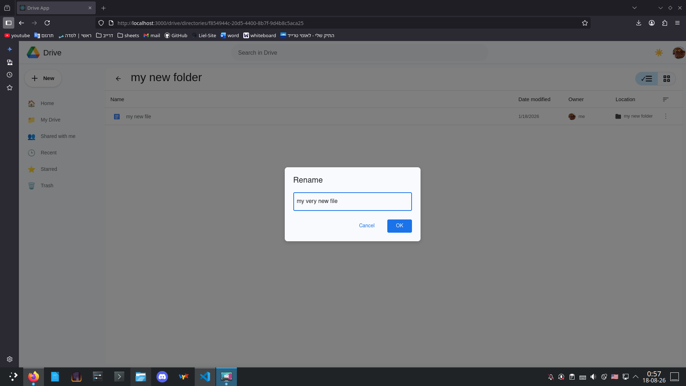
## Running Videos
### Connecting to the server
In this video we show how to Sign up and how to Log in:  
<video src="https://github.com/user-attachments/assets/6aa8d47e-07bd-4df5-9671-89ece88c1c67" controls width="600"></video>

### Share
In this video we show how to share files between different users:  
<video src="https://github.com/user-attachments/assets/c09cbb59-ee84-4ecf-b110-4b50765cdbaa" controls width="600"></video>

### Simple Files
In this video we show how to: upload text files and image files, create new text files, and create new folders.
<video src="https://github.com/user-attachments/assets/cc3afa19-fbbe-4307-8582-c1dbcdc7fdfc" controls width="600"></video>

### More Featuers
In this video we show several additional features our drive support: renaming files, starring files, trashing files, and even downloading them in a matching format.
<video src="https://github.com/user-attachments/assets/2806a25c-9bab-459d-b54e-be097b87e4a3" controls width="600"></video>

### Dark Mode + Search
In this video we show how the search works and the dark mode also.
<video src="https://github.com/kingcodeguru/AdvanceProg-Part4/issues/5#issue-3827318223" controls width="600"></video>

