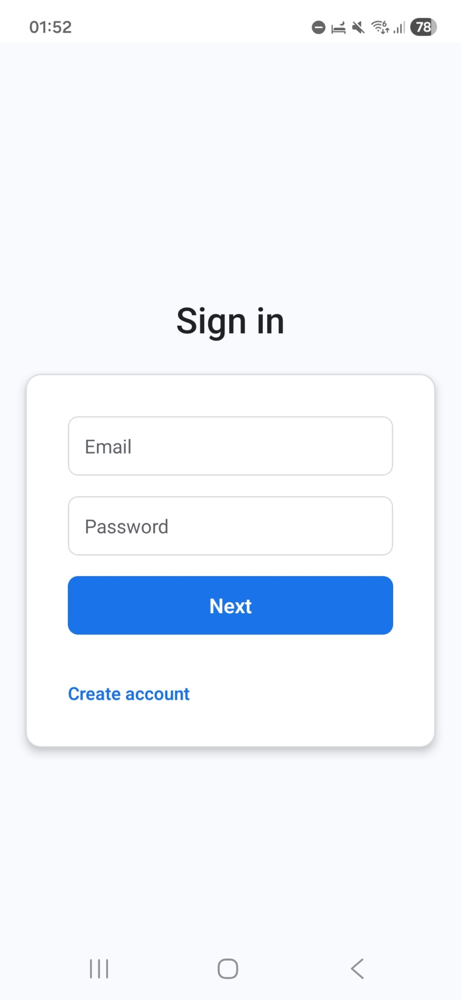
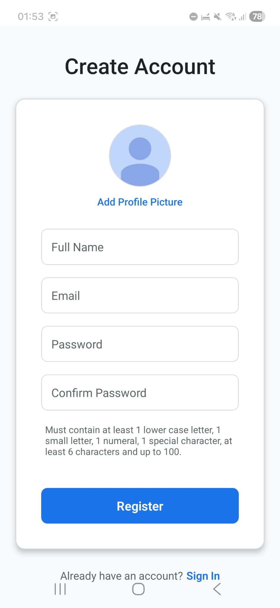
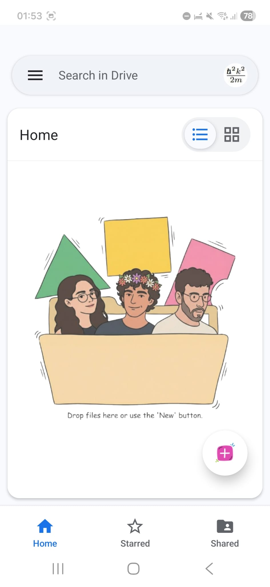
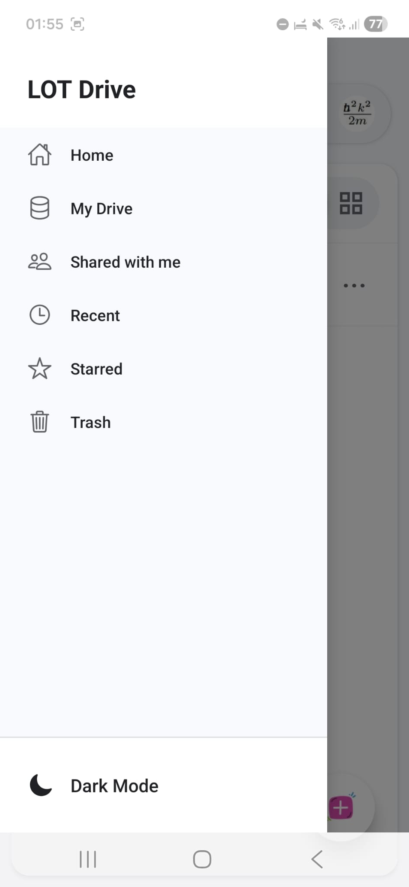
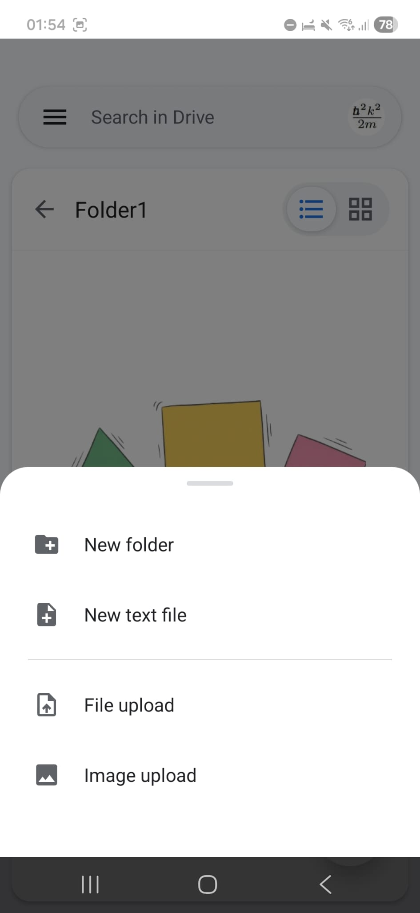
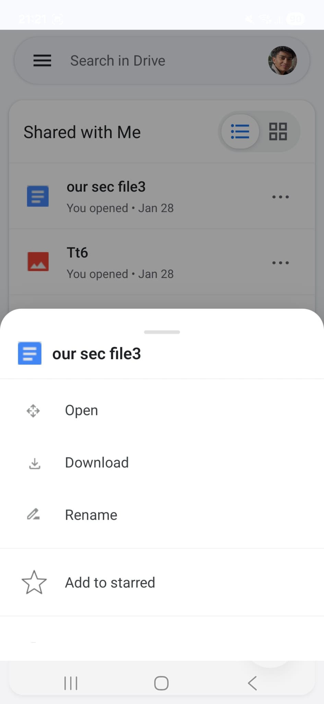
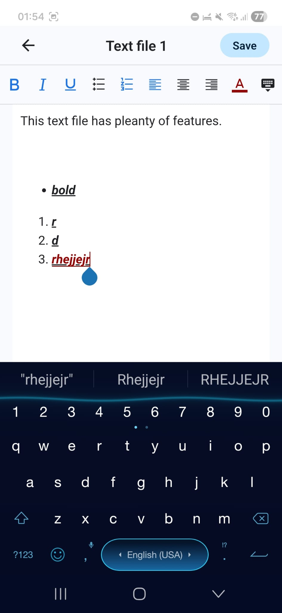
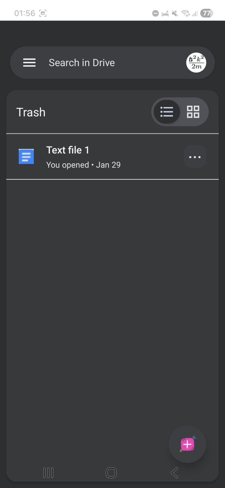

# 📱 User Guide & Features

## Pages Overview

### 1. Authentication
Secure access to your personal drive. The sign-up process includes validation to ensure strong security for your account.

| Log-in Page | Sign-up Page |
| :---: | :---: |
|  |  |

---

### 2. Main Dashboard & Navigation
The central hub for your files. The design focuses on simplicity and ease of use.

#### Home Screen
When your folder is empty, you are greeted with a clean interface waiting for your content.

#### Side Navigation
Access the global navigation drawer by clicking the hamburger menu (`≡`). From here, you can quickly jump to:
* **Home**: Your main landing area.
* **My Drive**: Your complete folder hierarchy.
* **Shared with me**: Files others have shared with you.
* **Recent**: Quickly access files you just opened.
* **Starred**: Your favorites.
* **Trash**: Recover deleted items.
* **Dark Mode Toggle**: Switch the app theme instantly.

---

### 3. Creating & Uploading Content
The floating action button (Pink `+`) is your gateway to adding content.

**The "Plus" Menu allows you to:**
* Create **New Folders**.
* Create **New Text Files** directly in the app.
* **Upload Files** from your device storage.
* **Upload Images** from your gallery.

---

### 4. File Management
Manage your files with a comprehensive action menu. Clicking the three dots (`...`) on any file opens the **Action Modal**.

**Available Actions:**
* **Open**: View or edit the file.
* **Download**: Save the file to your local device.
* **Rename**: Change the filename.
* **Add to Starred**: Mark important files for quick access.

---

### 5. Editors & Viewers
The app supports built-in viewing and editing.

#### Rich Text Editor
A fully functional text editor supporting bold, italics, lists, and alignment.

---

### 6. Theme Support (Dark Mode)
The application supports a fully integrated **Dark Mode** for low-light environments. This can be toggled directly from the sidebar.

| Dark Mode Dashboard |
| :---: |
|  |

[⬅️ Back to Main README](../README.md)